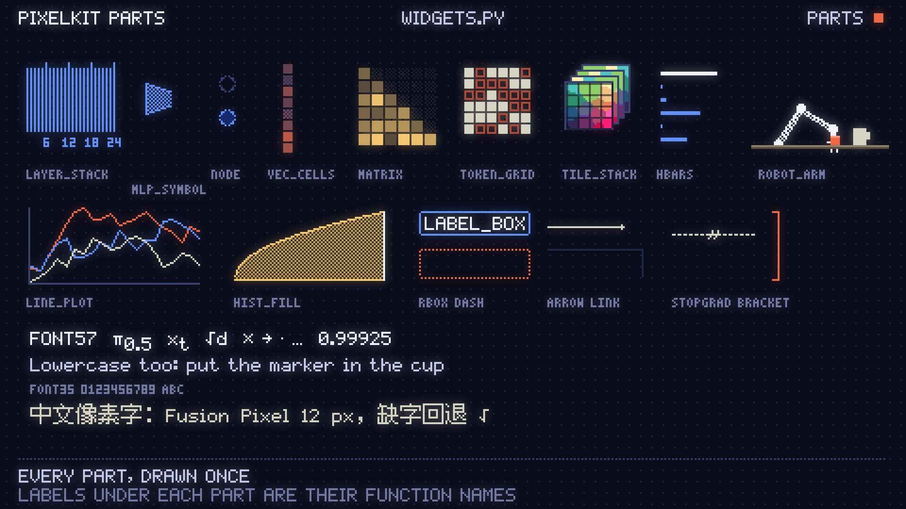

# Pixel Video

Pixel Video is a Claude Code skill for turning a topic, paper, or code repository into a short pixel-art animation that explains one mechanism step by step. It includes a Python renderer, English scene templates, reusable visual components, layout checks, cover generation, and reference-video analysis tools.

## Video style references

This skill's pixel-art video style was inspired by [videos from Dmytro Hrybov](https://x.com/dimentary) and [this video by Carlos Santana (DotCSV)](https://x.com/DotCSV/status/2102810407928819866). Thanks to both creators for the inspiration.



## Install

Requires Python 3.10+, Git, curl, FFmpeg with `ffprobe`, and Poppler with `pdftotext`, `pdftoppm`, and `pdfimages`.

```bash
mkdir -p ~/.claude/skills
git clone https://github.com/VistrendAI/pixel-video.git ~/.claude/skills/pixel-video
chmod +x ~/.claude/skills/pixel-video/pxv
python3 -m pip install numpy opencv-python pillow
```

In Claude Code, ask “Explain how KV Cache works as a pixel-art animation in English,” or invoke `/pixel-video`. See [SKILL.md](SKILL.md) for the full workflow and [STYLE.md](STYLE.md) for the visual specification.

## Quick start

```bash
PXV="$HOME/.claude/skills/pixel-video/pxv"
mkdir -p pixel-video-demo
cd pixel-video-demo
"$PXV" new v2 hello.py
"$PXV" check hello.py --lang en
"$PXV" render hello.py --lang en
```

The video is written to `out/hello_en.mp4`. To start from a paper, run `"$PXV" init MyTopic --paper <arXiv-ID>`, then complete the facts sheet, edit the scene, check it, and render. Call `pxv` through its full path rather than a symlink.

## Repository guide

| Path | Purpose |
| --- | --- |
| [SKILL.md](SKILL.md) · [STYLE.md](STYLE.md) | Workflow and visual specification |
| [pxv](pxv) · [pixelkit/](pixelkit/) | CLI entry point, rendering and visual components |
| [templates/](templates/) · [examples/](examples/) | Scene templates, facts sheet, examples and widget gallery |
| [tools/analyze.py](tools/analyze.py) | Reference-video analysis |

`pxv init` creates projects under the current directory by default; use `--root` or `--dir` to choose another location. Reference videos and training data are not included.
